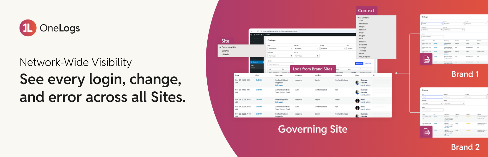

# OneLogs

Contributors: [rtcamp](https://profiles.wordpress.org/rtcamp), [whopiyush](https://github.com/whopiyush), [patil-vipul](https://github.com/patil-vipul), [up1512001](https://github.com/up1512001), [justlevine](https://github.com/justlevine), [aviral-mittal](https://github.com/aviral-mittal), [rishavjeet](https://github.com/rishavjeet), [vishal4669](https://github.com/vishal4669), [vishalkakadiya](https://github.com/vishalkakadiya)

Tags: OneLogs, Site Logs, Logs Sync, Site Auditing, Records, WordPress network, Site Activity, Activity management, WordPress plugin, Debug, Compliance

This tool enables unified activity log visibility and governance monitoring across all sites in a WordPress multisite or OnePress network.

## Description

OneLogs extends the capabilities of the [Stream](https://wordpress.org/plugins/stream/) plugin by providing a centralized interface for viewing and managing logs across multiple connected sites.

Built as part of the OnePress Framework, OneLogs bridges the gap between individual site activity tracking and network-level monitoring, helping teams maintain visibility, compliance, and operational awareness across their digital ecosystem.

## Why OneLogs?

In multi-site environments or enterprise networks, managing user activity and ensuring compliance across all sites can quickly become complex.

While Stream provides detailed local logging, OneLogs takes it a step further, aggregating and governing activity logs across the OnePress network for improved oversight and operational transparency.

### Benefits

- **Unified Visibility**: Monitor activity across all connected sites from a single, centralized dashboard.

- **Proactive Issue Detection**: Spot unusual activity in real time and investigate directly from the governing site.

- **Compliance & Audit**: Maintain complete audit trails of all site actions across users and contexts.

- **Stream-Powered Logging**: Built on top of the reliable Stream plugin, ensuring robust and proven event tracking.

- **Network-Wide Governance**: Distinguish between governing and brand site activity with easy site-based filtering.

- **Time-Saving**: Eliminate the need to switch sites or export logs manually from each brand site.

- **Flexible Export**: Export filtered logs to CSV for offline analysis, reporting, or archival purposes.

### Key Features

- **Stream Integration**: Uses Stream's event logging system for reliable, detailed tracking.

- **Unified Dashboard**: View and manage activity logs across all connected sites from one interface.

- **Site Selector**: Filter logs by Governing Site or individual Brand Sites.

- **Advanced Filtering**: Search by user, context, action, summary or date.

- **CSV Export**: Export selected or filtered logs directly to CSV for further analysis.

- **Brand-Aware Access**: Governing Site can view all logs; Brand Sites can only view their own.

- **Real-Time Sync**: Updates log entries instantly as new actions are recorded on connected sites.

## Requirements

| Requirement   | Version                                                                                   |
|---------------|-------------------------------------------------------------------------------------------|
| WordPress     | >= 6.8                                                                                    |
| PHP           | >= 8.2                                                                                    |
| Prerequisites | [Stream](https://wordpress.org/plugins/stream/) plugin installed and active on all sites. |

## Installation

1. Download the OneLogs plugin ZIP from the [latest GitHub release](https://github.com/rtCamp/OneLogs/releases/latest) and install it on your WordPress websites.
2. Ensure the [Stream](https://wordpress.org/plugins/stream/) plugin is active on all sites.
3. Activate the plugin via the WordPress Admin's `Plugins` screen.
    - For multisite installations, make sure to `Network Activate` the plugin.
4. Visit the `Dashboard > OneLogs > Settings` page to configure the Governing and Brand sites.

## How It Works

### Setting Up Governing and Brand Sites

1. Install and activate the Stream and OneLogs plugins on all sites.
2. From the OneLogs settings or the popup after plugin activation, designate one site as the "Governing Site" (the central log view).
3. Designate all other sites as "Brand Sites" (connected shared sites).
4. Copy the API keys generated for each Brand Site from their respective settings pages.
5. In the Governing Site settings, register each Brand Site by adding:

    - Site name
    - URL
    - API key

### Accessing the Logs Dashboard

1. On your Governing Site, open `OneLogs > Logs` from the sidebar.
2. Use the Site Selector dropdown to switch between:

    - Governing Site logs
    - Any connected Brand Site logs

3. On the Governing Site, Governing Site will be selected by default, on the Brand Sites, the respective Brand Site will be selected by default.
4. Use the Search field to find events by summary text.
5. Apply filters for Context, Action, Date, or User to narrow results.

### On a Brand Site

- The OneLogs Dashboard shows only the local Stream activity logs.
- Filtering, searching, and CSV export work the same way.
- Brand Sites cannot view or fetch logs from other sites.

## Development & Contributing

[OneLogs](https://github.com/rtCamp/OneLogs) is under active development and maintained
by [rtCamp](https://rtcamp.com/).

Contributions are **Welcome** and **encouraged!** To learn more about contributing to OneLogs, please read
the [Contributing Guide](./docs/CONTRIBUTING.md).

For development guidelines, please refer to our [Development Guide](./docs/DEVELOPMENT.md).

## Frequently Asked Questions

### Does OneLogs replace Stream?

OneLogs does not replace Stream. OneLogs extends Stream to provide centralized visibility across sites. You must have Stream active for OneLogs to work.

### What filters are supported?

You can filter the dashboard logs by `Site`, `User`, `Context`, `Action` and `Date Range`.

### What fields are searched?

The search functionality searches within the `Summary` column of the logs.

### Can I export logs?

Yes. You can export filtered or complete log datasets to CSV directly from the dashboard.

## Troubleshooting

1. **No brand site logs visible on the Governing Site**

    - Ensure both `Stream` and `OneLogs` plugins are active on each Brand Site.
    - Verify API keys and REST endpoints are correctly configured.
    - Verify any customizations made to REST API permissions.

2. **CSV export missing data**

    - Try exporting without filters to confirm the data is correctly fetched.
    - Verify configured filters aren't too restrictive.

## Get Involved

You can join the development and discussions on [GitHub](https://github.com/rtCamp/OneLogs). Feel free to
report issues, suggest features, or contribute code.

## License

This plugin is licensed under the GPL v2 or later.
